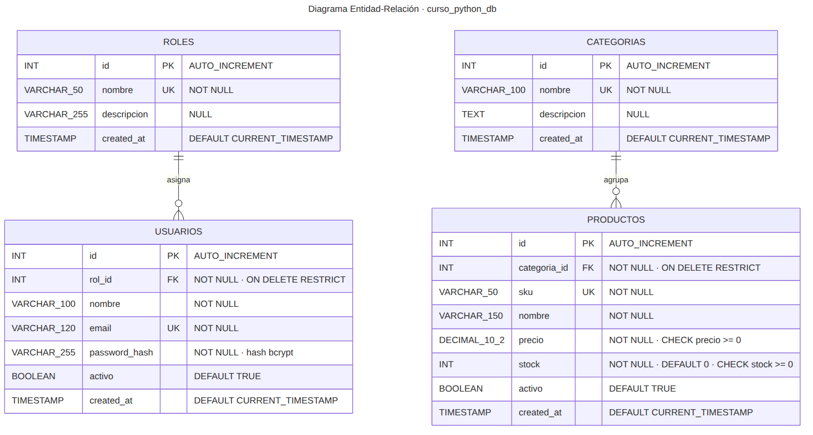
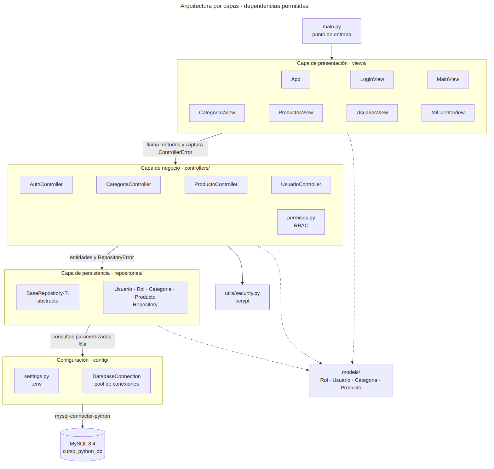
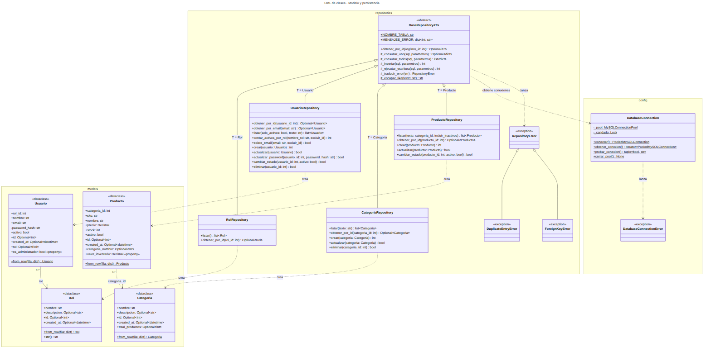
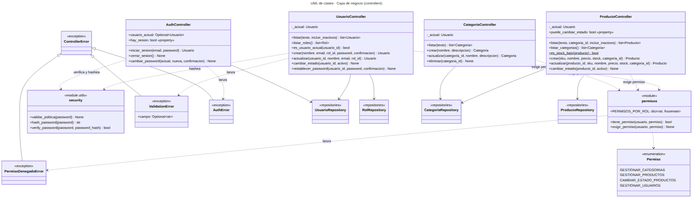
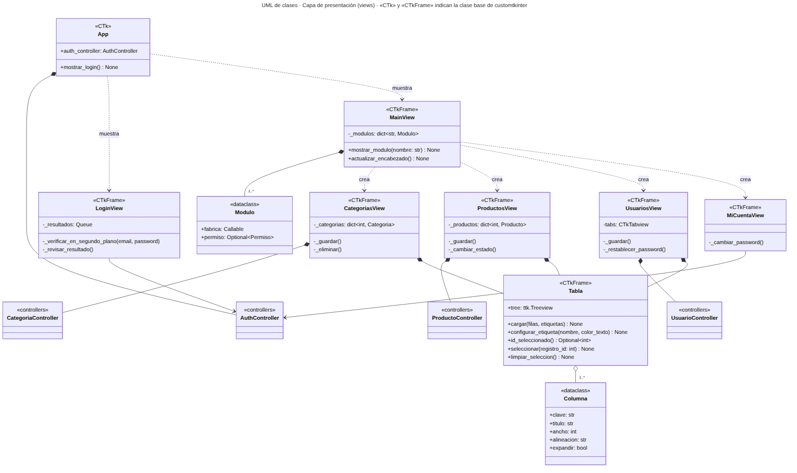

# Diagramas del sistema de inventario

Los diagramas están escritos en [Mermaid](https://mermaid.js.org/), un lenguaje de texto para diagramas. Cada uno tiene tres archivos en `docs/diagramas/`:

| Archivo | Para qué sirve |
|---|---|
| `.mmd` | Fuente editable. Se versiona junto con el código. |
| `.svg` | Imagen vectorial; no pierde calidad al ampliarla. |
| `.png` | Imagen para insertar en Word, PowerPoint o PDF. |

## Cómo verlos y editarlos

- **VS Code:** instale la extensión *Markdown Preview Mermaid Support* y abra la vista previa de este archivo, o use *Mermaid Chart* para abrir los `.mmd` directamente.
- **En el navegador:** copie el contenido de un `.mmd` en <https://mermaid.live>.
- **Regenerar las imágenes** después de editar un `.mmd` (requiere Node.js):

  ```bash
  npm install -g @mermaid-js/mermaid-cli
  cd docs/diagramas
  mmdc -i 01_entidad_relacion.mmd -o 01_entidad_relacion.svg -b white
  mmdc -i 01_entidad_relacion.mmd -o 01_entidad_relacion.png -b white -s 2
  ```

---

## 1. Diagrama Entidad-Relación



Corresponde a `database/mysql_DDL.sql`. Mermaid no admite paréntesis ni comas en el tipo de dato, por eso `VARCHAR(50)` aparece como `VARCHAR_50` y `DECIMAL(10,2)` como `DECIMAL_10_2`.

**Relaciones**

| Relación | Cardinalidad | Llave foránea | Al borrar el padre |
|---|---|---|---|
| `roles` → `usuarios` | Un rol tiene cero o más usuarios; cada usuario tiene exactamente un rol. | `usuarios.rol_id` (NOT NULL) | `RESTRICT`: no se puede borrar un rol en uso. |
| `categorias` → `productos` | Una categoría tiene cero o más productos; cada producto pertenece a exactamente una. | `productos.categoria_id` (NOT NULL) | `RESTRICT`: no se puede borrar una categoría con productos, aunque estén inactivos. |

En la notación de "pata de gallo", `||` significa "exactamente uno" y `o{` significa "cero o más".

**Normalización**

- **1FN:** todos los atributos son atómicos; no hay listas dentro de una columna.
- **2FN:** cada tabla tiene una llave primaria simple (`id`), así que no puede haber dependencias parciales.
- **3FN:** no hay dependencias transitivas. Por ejemplo, el nombre de la categoría no se repite en `productos`: se obtiene con un `JOIN`. `Categoria.total_productos` y `Producto.categoria_nombre` existen solo en los objetos de Python y se calculan en la consulta; no son columnas.

**Restricciones que protegen los datos aunque falle la aplicación**

- `UNIQUE` en `roles.nombre`, `usuarios.email`, `categorias.nombre` y `productos.sku`.
- `CHECK (precio >= 0)` y `CHECK (stock >= 0)` en `productos`.
- `usuarios.password_hash` guarda el hash bcrypt, nunca la contraseña.

---

## 2. Arquitectura por capas



Las flechas continuas indican qué capa puede llamar a cuál: siempre hacia abajo. Las punteadas indican que las tres capas usan las clases de `models/`.

Reglas que se verificaron en el código:

- Ningún archivo de `views/` importa `mysql`, `config.db_connection` ni `repositories`, ni contiene sentencias SQL.
- Ningún archivo de `controllers/` importa `mysql`: los errores del driver llegan traducidos como `RepositoryError` o `DatabaseConnectionError`.
- Las vistas solo capturan `ControllerError` y sus subclases.

---

## 3. UML de clases · Modelo y persistencia



Aspectos que conviene observar:

- `BaseRepository~T~` es **abstracta** (`abc.ABC`) y **genérica** (`Generic[T]`). El método en cursiva, `obtener_por_id`, es abstracto: cada subclase debe implementarlo.
- Las cuatro subclases fijan el parámetro de tipo: `UsuarioRepository` es `BaseRepository[Usuario]`, etc.
- Los métodos protegidos (`#`) de `BaseRepository` concentran la conexión, el `commit`, el `rollback` y la traducción de errores; las subclases solo escriben SQL.
- `DatabaseConnection` tiene solo miembros de clase (subrayados): el pool es único y compartido por todos los repositorios.
- `Usuario → Rol` es una asociación: el objeto `Usuario` puede contener su `Rol` completo. `Producto ..> Categoria` es solo una dependencia por `categoria_id`; el objeto guarda el nombre, no la instancia.

---

## 4. UML de clases · Capa de negocio



- Los controladores de categorías, productos y usuarios reciben el usuario de la sesión (`_actual`) y consultan `permisos` antes de cada operación. Si no hay permiso, se lanza `PermisoDenegadoError`.
- `Permiso` es una enumeración (`enum.Enum`) y `PERMISOS_POR_ROL` asigna a cada rol su conjunto de permisos.
- Todas las excepciones que llegan a la interfaz heredan de `ControllerError`. `ValidationError` agrega el atributo `campo`, que la vista usa para enfocar el control con el error.
- Solo `AuthController` y `UsuarioController` usan `utils.security` (bcrypt).

---

## 5. UML de clases · Capa de presentación



- `App` hereda de `CTk` (la única ventana raíz) y las pantallas heredan de `CTkFrame`. Se indican como estereotipos para no llenar el diagrama de flechas de herencia.
- `App` alterna entre `LoginView` y `MainView` dentro de la misma ventana.
- `MainView` contiene una lista de `Modulo` (pantalla + permiso requerido) y crea la pantalla elegida en el menú.
- Cada pantalla de gestión **compone** su controlador (rombo relleno): lo crea y vive con él. `LoginView` y `MiCuentaView` **usan** el `AuthController` que les pasa `App`.
- `Tabla` envuelve un `ttk.Treeview` y se reutiliza en las tres pantallas de gestión.

---

## Notación UML utilizada

| Símbolo | Significado |
|---|---|
| `+` | Público |
| `-` | Privado (en Python, por convención, nombre con `_`) |
| `#` | Protegido: pensado para usarse desde subclases |
| Subrayado / `$` | Miembro de clase (`@classmethod`, `@staticmethod`, `ClassVar`) |
| Cursiva / `*` | Método abstracto (`@abstractmethod`) |
| `«…»` | Estereotipo: `«dataclass»`, `«abstract»`, `«exception»`, `«enumeration»`, `«module»` |
| `Tipo~T~` | Tipo genérico, equivale a `Tipo[T]` en Python |
| Triángulo hueco `◁──` | Herencia |
| Rombo relleno `◆──` | Composición: la parte se crea y se destruye con el todo |
| Rombo hueco `◇──` | Agregación: el todo usa partes que existen por separado |
| Flecha continua `──>` | Asociación: la clase guarda una referencia a la otra |
| Flecha punteada `..>` | Dependencia: la usa, la crea o la lanza, sin guardarla |
